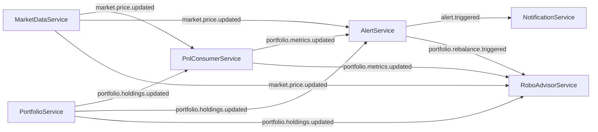

# WealthPulse

WealthPulse implements **Wealth+**, an event-driven investment platform. Investors register, open portfolios and buy or sell stocks. They get near-real-time P&L, price and portfolio alerts, and AI-generated rebalancing recommendations.

It is six independent Spring Boot microservices. They talk to each other only through Kafka: no synchronous calls, no shared library.

| Service | Port | Role |
|---|---|---|
| `PortfolioService` | 8081 | Investors, portfolios, buy/sell orders, holdings (REST) |
| `MarketDataService` | 8082 | Polls Finnhub every 30s and publishes price updates |
| `PnlConsumerService` | 8083 | Maintains portfolio value, invested amount and P&L |
| `AlertService` | — | Evaluates price/portfolio alert rules (no web server) |
| `NotificationService` | 8085 | Records triggered alerts (REST, read-only) |
| `RoboAdvisorService` | 8086 | OpenAI rebalancing recommendations (REST, read-only) |

## Event flow



`PortfolioService` also publishes `portfolio.order.executed` as an audit trail. Each consumer keeps its own read model in its own Postgres schema and has its own Kafka consumer group, so every service receives every event independently.

## Prerequisites

- JDK 21
- Docker (for Postgres 14, Kafka 4 in KRaft mode, Redis 7)
- A [Finnhub](https://finnhub.io) API key (free tier is enough)
- An OpenAI API key — only needed for `RoboAdvisorService` to produce recommendations

The Maven wrapper is committed, so no local Maven install is needed.

## Running locally

**1. Start infrastructure** from the repo root:

```bash
docker compose up -d
```

This starts Postgres on 5432 (`wealth_plus_db`, `user`/`password`), Kafka on 9092 and Redis on 6379.

**2. Build everything:**

```bash
./mvnw clean install        # mvnw.cmd on Windows cmd/PowerShell
```

**3. Set API keys** as environment variables (or in your IDE run configurations):

```bash
export FINNHUB_API_KEY=...   # MarketDataService
export OPENAI_API_KEY=...    # RoboAdvisorService
```

Never put them in `application.yaml`.

**4. Start each service** in its own terminal:

```bash
cd PortfolioService && ./mvnw spring-boot:run
```

Repeat for the other five. Start order does not matter. Each service creates its own schema through Flyway on first boot, and Kafka topics are created automatically.

`AlertService` binds no HTTP port, so a port check against it will always fail. It is running if its log shows `Started AlertServiceApplication` and the `alert-service` consumer group has members.

## Trying it out

Request and response bodies use snake_case. `risk_profile` is one of `CONSERVATIVE`, `MODERATE`, `AGGRESSIVE`.

```bash
# Create an investor → returns the investor id
curl -X POST localhost:8081/investors -H 'Content-Type: application/json' \
  -d '{"name":"Asha","email":"asha@example.com","risk_profile":"MODERATE"}'

# Open a portfolio → returns the portfolio id
# (the parameter really is spelled portfolio_mame for now; see Known limitations)
curl -X POST 'localhost:8081/investors/1/portfolios?portfolio_mame=Growth'

# Buy and sell → each returns the order id
curl -X POST localhost:8081/orders/buy -H 'Content-Type: application/json' \
  -d '{"portfolio_id":1,"symbol":"AAPL","price":100,"quantity":1}'
curl -X POST localhost:8081/orders/sell -H 'Content-Type: application/json' \
  -d '{"portfolio_id":1,"symbol":"AAPL","price":120,"quantity":1}'

# Read back
curl 'localhost:8081/orders?portfolio_id=1'
curl 'localhost:8081/holdings?portfolio_id=1'
curl 'localhost:8085/notifications?portfolio_id=1'
curl 'localhost:8086/recommendations?portfolio_id=1'
```

Market data is polled for `AAPL`, `MSFT`, `GOOG`, `AMZN` and `TSLA`. Within about 30 seconds of a buy, the portfolio's metrics appear in Postgres:

```sql
SELECT * FROM pnl.portfolio_metrics;
```

Errors return `{timestamp, status, error, message}`: 400 for invalid input, 404 for an unknown investor/portfolio/holding, 409 for a duplicate, 422 for a business-rule violation such as selling more than you hold.

### Firing an alert

There is no API for creating alert rules yet. To see the alert → notification → recommendation path, insert a row into `alert.alert_configuration` by hand; its columns are defined in `AlertService/src/main/resources/db/migration/V1__init.sql`. The next matching price tick will write `alert.alert_history`, publish `alert.triggered` and show up in `/notifications`. A `PORTFOLIO_DRIFT` rule additionally triggers a recommendation in `/recommendations`. Each rule fires at most once per 30 minutes.

## Tests

```bash
./mvnw test                            # all services, from the root
cd PortfolioService && ./mvnw test     # one service
```

Coverage is currently only a context-load smoke test per service. Testcontainers-based tests are planned.

## Known limitations

- No authentication. Any caller can read any portfolio.
- Notifications are logged and stored, not delivered: no event carries investor contact details yet.
- Alert rules have no create API (see above).
- Kafka publish failures are logged, not retried. A failed publish means downstream services miss that update.
- `POST /investors/{id}/portfolios` takes a misspelled `portfolio_mame` parameter.

## Roadmap

[`BUILD_PHASES.md`](BUILD_PHASES.md) holds the phased plan: stabilisation, then Swagger/OpenAPI, Testcontainers, transactional outbox, dead-letter topics, JWT, observability (Prometheus/Grafana/Zipkin), CI/CD, and the remaining functional gaps.

[`Project Guide.pdf`](Project%20Guide.pdf) is the original design brief. Contributor conventions live in [`.claude/CLAUDE.md`](.claude/CLAUDE.md) and [`.claude/rules/`](.claude/rules/).
